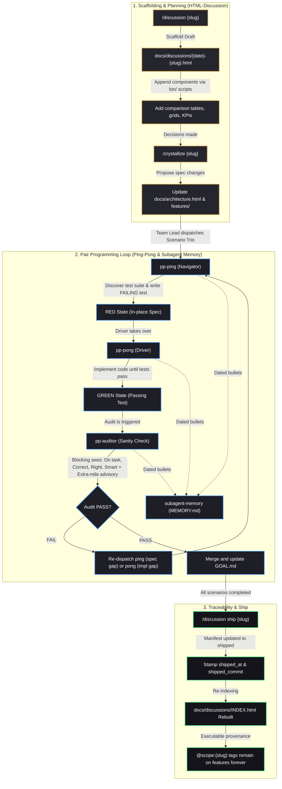

```text
███████╗ ██████╗ ██╗   ██╗██████╗  ██████╗ ██████╗ ██╗      ██████╗ ██████╗ ███████╗
██╔════╝██╔═══██╗██║   ██║██╔══██╗██╔════╝██╔═══██╗██║     ██╔═══██╗██╔══██╗██╔════╝
█████╗  ██║   ██║██║   ██║██████╔╝██║     ██║   ██║██║     ██║   ██║██████╔╝███████╗
██╔══╝  ██║   ██║██║   ██║██╔══██╗██║     ██║   ██║██║     ██║   ██║██╔══██╗╚════██║
██║     ╚██████╔╝╚██████╔╝██║  ██║╚██████╗╚██████╔╝███████╗╚██████╔╝██║  ██║███████║
╚═╝      ╚═════╝  ╚═════╝ ╚═╝  ╚═╝ ╚═════╝ ╚═════╝ ╚══════╝ ╚═════╝ ╚═╝  ╚═╝╚══════╝

                    ███████╗██╗  ██╗██╗██╗     ██╗     ███████╗
                    ██╔════╝██║ ██╔╝██║██║     ██║     ██╔════╝
                    ███████╗█████╔╝ ██║██║     ██║     ███████╗
                    ╚════██║██╔═██╗ ██║██║     ██║     ╚════██║
                    ███████║██║  ██╗██║███████╗███████╗███████║
                    ╚══════╝╚═╝  ╚═╝╚═╝╚══════╝╚══════╝╚══════╝
```

# fourcolors skills

A curated pack of production-grade, highly optimized capabilities and workflow guidelines designed for AI coding assistants (such as Claude Code, Cursor, Windsurf, and others). 

This repository is maintained by **fourcolors** and is fully installable and manageable with the open [`skills` CLI](https://skills.sh).

---

## How AI Agent Skills Work

Agent skills are a standardized method of injecting **procedural knowledge** and **specialized behaviors** into AI coding assistants without polluting their permanent context window. They operate under two primary principles:

### 1. Declarative & Procedural Instruction (`SKILL.md`)
Each skill is organized in a directory containing a structured `SKILL.md` file. While the human-facing `README.md` documents general features, the `SKILL.md` uses specialized frontmatter (YAML) and system-instruction language specifically designed to guide LLMs and autonomous agents on how to execute tasks safely, repeatably, and cleanly.

### 2. Progressive Disclosure
To prevent prompt bloat and keep context windows highly efficient:
- At the start of a session, the AI agent **only preloads** the skill’s frontmatter metadata (the `name` and `description`).
- The full instruction set inside `SKILL.md` is **not loaded** initially.
- Instead, the agent detects when a user request matches the skill's metadata and dynamically issues a `view_file` or fetch call to load the complete instructions only when relevant.

---

## Active Skills Index

| Skill | Category | Description |
|---|---|---|
| [`scratch`](./skills/scratch) | **Workflow** | Light, project-local `.scratch/` folder convention for temporary development scripts and artifacts without polluting the main codebase. |
| [`ping-pong`](./skills/ping-pong) | **Multi-Agent** | A robust pair programming and quality-control simulation orchestrating specialized navigator (`pp-ping`), driver (`pp-pong`), and QC auditor (`pp-auditor`) subagents. |
| [`subagent-memory`](./skills/subagent-memory) | **Cognition** | An observational memory discipline for subagents using date-grouped entries, priority emojis, and a CLI reflection pass to avoid context cliff issues. |
| [`html-discussion`](./skills/html-discussion) | **Visual Planning** | Script-driven, byte-addressable HTML planning artifact generator supporting option comparison tables, neomorphic/glassmorphism themes, and structured snippets. |

---

## Development & Execution Lifecycle

This diagram illustrates how all the packaged skills (`html-discussion`, `ping-pong`, `subagent-memory`, and `scratch`) and custom slash commands (`/discussion`, `/crystallize`) coordinate dynamically throughout your system development process:



---

## Repository Layout

```text
skills/
├── LICENSE
├── README.md              <-- You are here
└── skills/
    ├── scratch/
    │   ├── SKILL.md       <-- Agent-facing rules
    │   └── templates/
    │       └── README.md
    ├── ping-pong/
    │   ├── SKILL.md       <-- Orchestrator guidelines
    │   ├── README.md      <-- Human instructions
    │   ├── agents/        <-- Subagent definitions
    │   │   ├── pp-ping.md
    │   │   ├── pp-pong.md
    │   │   └── pp-auditor.md
    │   └── references/    <-- Loaded on demand by the lead, not at trigger time
    │       ├── briefs.md
    │       ├── audit-modes.md
    │       └── monitoring.md
    ├── subagent-memory/
    │   ├── SKILL.md       <-- Memory rules
    │   ├── README.md      <-- Human instructions
    │   └── templates/
    │       └── MEMORY.md
    └── html-discussion/
        ├── SKILL.md       <-- HTML artifact rules
        ├── README.md      <-- Human instructions
        ├── bin/           <-- Mutation shell scripts
        ├── snippets/      <-- HTML slot component blueprints
        ├── themes/        <-- Glassmorphism & neomorphism CSS themes
        └── commands/      <-- Custom slash command definitions (crystallize, discussion)
```

---

## Installation

Install individual skills globally or locally inside your projects using the `skills` CLI:

### Project-Scoped (Recommended)
Project-scoped installations commit the skill metadata locally so anyone working on the repository shares the same agent guidelines.

```bash
# Install Scratch
npx skills add fourcolors/skills --skill scratch -a claude-code

# Install Ping-Pong
npx skills add fourcolors/skills --skill ping-pong -a claude-code

# Install Subagent Memory
npx skills add fourcolors/skills --skill subagent-memory -a claude-code

# Install HTML Discussion
npx skills add fourcolors/skills --skill html-discussion -a claude-code
```

### Global (User-Scoped)
Global installations make the skills available across all your local command-line and editor sessions.

```bash
npx skills add fourcolors/skills --skill <skill-name> -g
```

---

## Development & Local Testing

If you are contributing to this pack or testing changes locally:

### 1. List Discoverable Skills
Scan your local repository tree using the CLI compiler to ensure everything formats correctly:
```bash
npx skills add . --list
```

### 2. Install Locally for Testing
Verify local compilation and copying by installing directly from your working directory:
```bash
npx skills add . --skill <skill-name> -a claude-code
```
